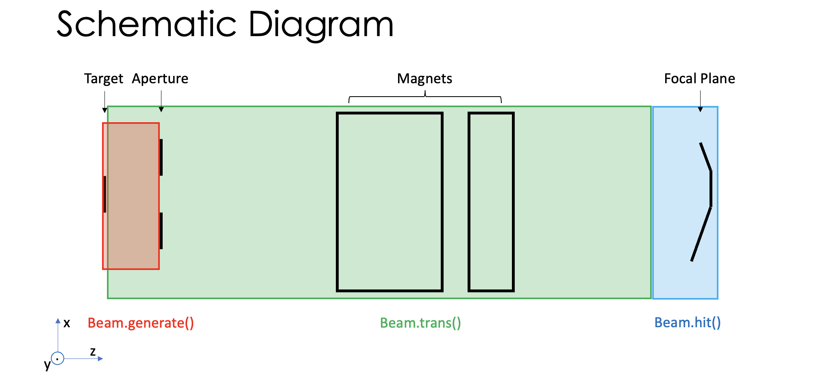

# Synthetic MPR

> For users: TM.txt is incomplete, it's still runable but the results will be non-physical. Please contact Xutao Xu for a realistic TM.txt if you want.

[中文翻译请点击这里(by DeepSeek-R1, Sep 25 2025)](#chinese-translation)

## A quick start

1. Specify `Target`, `Aperture`, `Magnets` and `Focalplane`, they are all **class** objects defined in `components.py`.
2. Run in the following order: `Beam.generate()` (or other alternatives), `Beam.trans()` and `Beam.hit()`. All methods above are mentioned under **Beam: class** in `processes.py`.
3. Do the following visualization and statistics as you wish!

```python
# There are two ways to specify the geometry of one target: 
# 1) by giving geometry directly; 2) by giving area and H_W_ratio.
target1 = Target(type = 'CH2', mass_thickness = 1.0, shape = 'rectangle', geometry = [width, height])
target2 = Target(type = 'CH2', mass_thickness = 1.0, shape = 'rectangle', area = 1.0, H_W_ratio = 3/2)

# Same situation when it comes to the specification of an aperture:
aperture = Aperture(distance = 1.0, shape = 'circle', area = 1.0, H_W_ratio = 1.0)

magnets = Magnets(file_path = "TM.txt", reference_energy = 10)

# Two kinds of focal plane: normal (perpendicular to the reference beam, straight); arbitrary.
focalplane1 = FocalPlane(type = 'normal', position = 1.0)
focalplane2 = FocalPlane(type = 'arbitrary', geomotry = geometry)

# Beam generation - using Target and Aperture
beam1 = Beam.generate(Target, Aperture, energy = 10, Npart = 100, cross_section = cross_section)
beam2 = Beam.generate_monoenergetic_parrallel(Target, energy = 10, Npart = 100)
beam3 = Beam.generate_monoenergetic_cone(energy = 10, Npart = 100, a_max = 0.01)

beam_tranported = beam1.trans(magnets)

record = beam_transported.hit(focalplane1)
```

## Schematic Diagram

For you to better understand the setting of this synthetic system, see the schematic diagram down below.



## Useful integrated tools in `mpr_system.py`

Simply using `Target`, `Aperture`, `Magnets` and `Focalplane`, you can specify a new class object: `MPR`. It's a great way to represent your MPR system!

```python
mpr = MPR(target, aperture, magnet, focalplane)
```

Or, if you're not sure about where to place your focal plane, it's OK to initialize without a `FocalPlane` object:

```python
mpr = MPR(target, aperture, magnet)
```

Up to now, the `MPR` object has the following functions:

1. `MPR.performance()`: calculates l-E relation and energy resolution in a given energy range.
2. `MPR.optimal_focalplane()`: finds optimal **straight** focal plane position (including position and tilt angle) under given boundaries. This method would automatically **overwrite** self.focalplane. So, if you initialized `MPR` without providing `FocalPlane`, you should run this method before others.
3. `MPR.save_focalplane()`: saves the current focal plane's geometry (list of (x, z) tuples) to the given path.
4. `MPR.response_matrix()`: calculates response matrix of the MPR system.

```python
mpr.performance()

# The merit, which is minimized during optimization, can be difined in two ways:
# 1) uniformly average of energy resolution at different energy; 2) weighted averge of ~  
mpr.optimal_focalplane(merit_weight = 'uniform', fp_position = np.linspace(0, 0.5, 11), fp_angle = np.linspace(10, 30, 6))
mpr.optimal_focalplane(merit_weight = 'whatever', fp_position = np.linspace(0, 0.5, 11), fp_angle = np.linspace(10, 30, 6), merit_weight_lst = [1,2,3,4,5,6,5,4,3,2,1])

mpr.save_focalplane(save_path = save_path)

mpr.response_matrix(save_path = save_path, plot_save = True)
```

## I/O files

All extra required input files and possible output files of each code in `Syn_MPR_v2` will be listed here. Cross section data file (*E4R84432_e4.endf.endf2gnd.endf*) and energy stopping power data file (*ESP(PSTAR).dat*) are not included.

|
**code name**
|
**input file(s)**
|
**output file(s)**
|
|
`Magnets.__init__()`
|
*TM.txt* (output by COSY INFINITY) see in [COSY Manual Files](https://www.bmtdynamics.org/cosy/manual/).
|
\
|
|
`MPR.performance()`
|
\
|
*L_E_relation.png* and *energy_resolution.png* if optional parameter `plot_save = True`.
|
|
`MPR.save_focalplane()`
|
\
|
*fp.txt* will be in the directory specified by parameter `save_path`.
|
|
`MPR.response_matrix()`
|
\
|
*response_matrix.npz* including the 2d array of response matrix, l bin edges and En bin edges (both are 1d array). In `save_path` when `plot_save = True`.
｜

***

<a id="chinese-translation"></a>

> 对于用户：TM.txt 文件不完整，虽然可以运行，但结果将是非物理的。如果您需要真实的 TM.txt 文件，请联系 Xutao Xu。

## 快速开始

1. 指定 `Target`（靶）、`Aperture`（孔径）、`Magnets`（磁铁）和 `Focalplane`（焦平面），它们都是在 `components.py` 中定义的**类**对象。
2. 按以下顺序运行：`Beam.generate()`（或其他替代方法）、`Beam.trans()` 和 `Beam.hit()`。上述所有方法都在 `processes.py` 中的 **Beam: class** 下提到。
3. 根据您的需求进行可视化和统计分析！

```python
# 有两种方式指定靶的几何形状：
# 1) 直接给出几何尺寸；2) 给出面积和高度宽度比。
target1 = Target(type = 'CH2', mass_thickness = 1.0, shape = 'rectangle', geometry = [width, height])
target2 = Target(type = 'CH2', mass_thickness = 1.0, shape = 'rectangle', area = 1.0, H_W_ratio = 3/2)

# 指定孔径时情况类似：
aperture = Aperture(distance = 1.0, shape = 'circle', area = 1.0, H_W_ratio = 1.0)

magnets = Magnets(file_path = "TM.txt", reference_energy = 10)

# 两种焦平面：法向（垂直于参考光束，直线）；任意。
focalplane1 = FocalPlane(type = 'normal', position = 1.0)
focalplane2 = FocalPlane(type = 'arbitrary', geomotry = geometry)

# 束流生成 - 使用 Target 和 Aperture
beam1 = Beam.generate(Target, Aperture, energy = 10, Npart = 100, cross_section = cross_section)
beam2 = Beam.generate_monoenergetic_parrallel(Target, energy = 10, Npart = 100)
beam3 = Beam.generate_monoenergetic_cone(energy = 10, Npart = 100, a_max = 0.01)

beam_tranported = beam1.trans(magnets)

record = beam_transported.hit(focalplane1)
```

## 示意图

为了帮助您更好地理解这个合成系统的设置，请参见下面的示意图。


## `mpr_system.py`中的有用集成工具

只需使用 `Target`、`Aperture`、`Magnets`和 `Focalplane`，您就可以指定一个新的类对象：`MPR`。这是表示您的 MPR系统的绝佳方式！

```python
mpr = MPR(target, aperture, magnet, focalplane)
```

或者，如果您不确定焦平面的位置，也可以在没有 `FocalPlane`对象的情况下初始化：

```python
mpr = MPR(target, aperture, magnet)
```

到目前为止，`MPR`对象具有以下功能：

1. `MPR.performance()`：在给定能量范围内计算 l-E关系和能量分辨率。
2. `MPR.optimal_focalplane()`：在给定边界下找到最优的**直线**焦平面位置（包括位置和倾斜角）。此方法会自动**覆盖** self.focalplane。因此，如果您在初始化 `MPR`时没有提供 `FocalPlane`，您应该在其他方法之前运行此方法。
3. `MPR.save_focalplane()`：将当前焦平面的几何形状（(x, z)元组列表）保存到给定路径。
4. `MPR.response_matrix()`：计算 MPR系统的响应矩阵。

```python
mpr.performance()

#优化过程中最小化的优值可以通过两种方式定义：
#1)不同能量下能量分辨率的均匀平均值；2)加权平均值mpr.optimal_focalplane(merit_weight = 'uniform', fp_position = np.linspace(0,0.5,11), fp_angle = np.linspace(10,30,6))
mpr.optimal_focalplane(merit_weight = 'whatever', fp_position = np.linspace(0,0.5,11), fp_angle = np.linspace(10,30,6), merit_weight_lst = [1,2,3,4,5,6,5,4,3,2,1])

mpr.save_focalplane(save_path = save_path)

mpr.response_matrix(save_path = save_path, plot_save = True)
```
